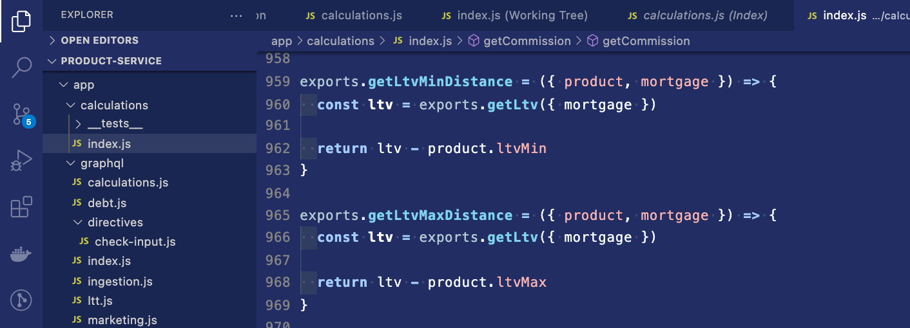
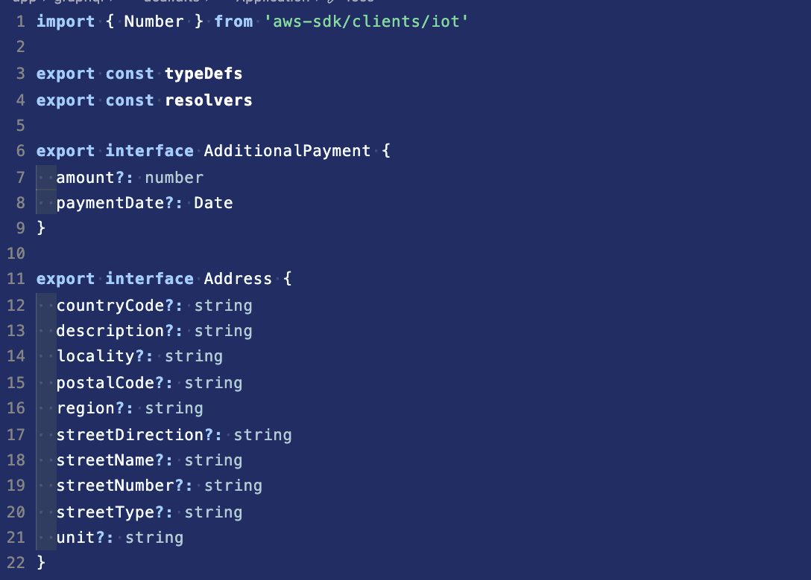
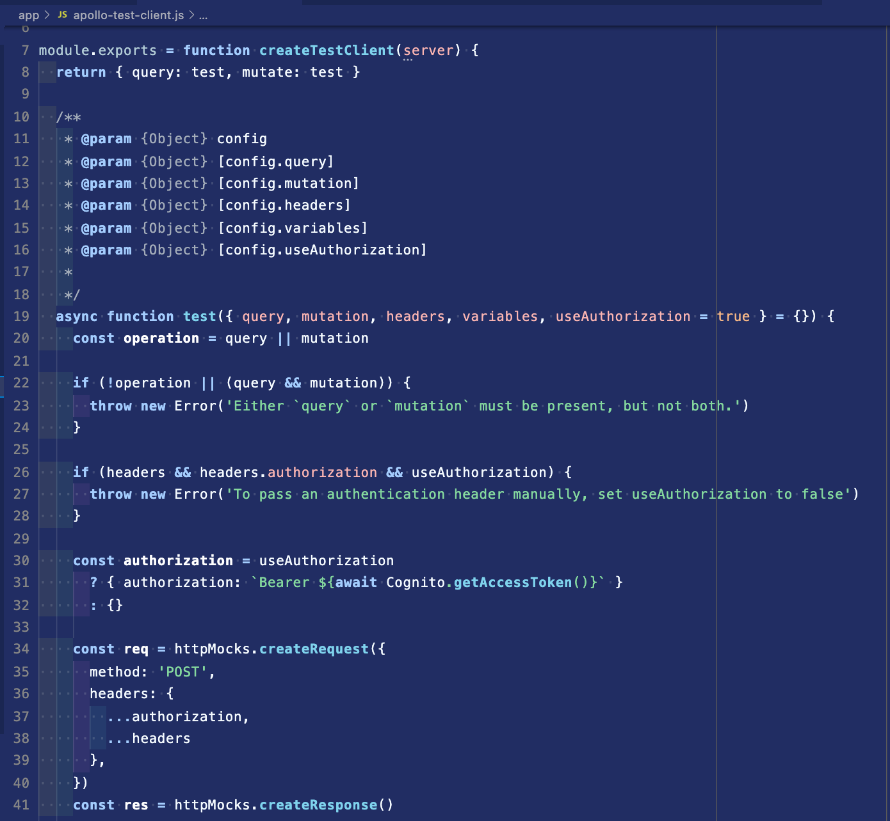
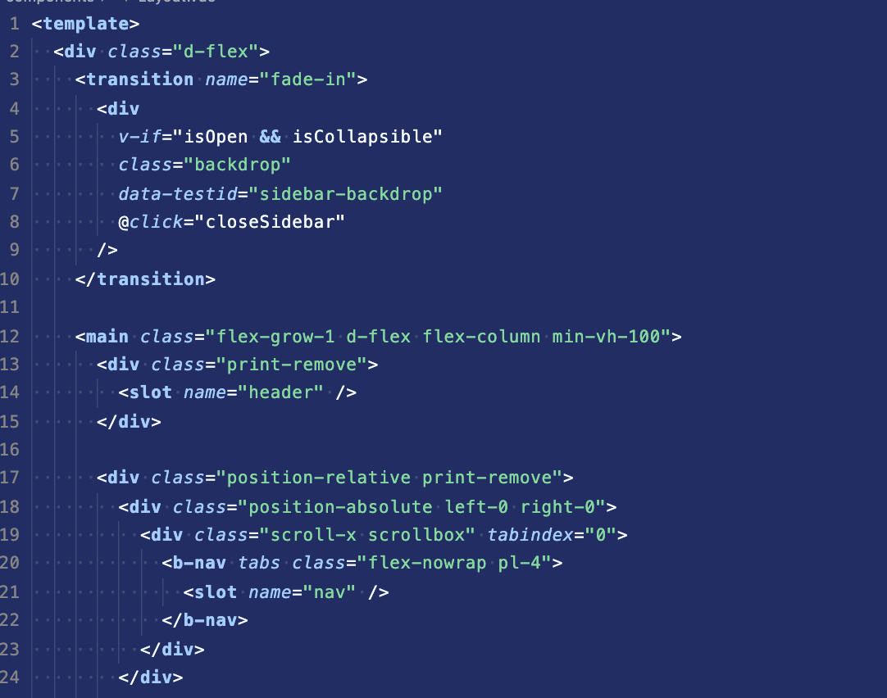
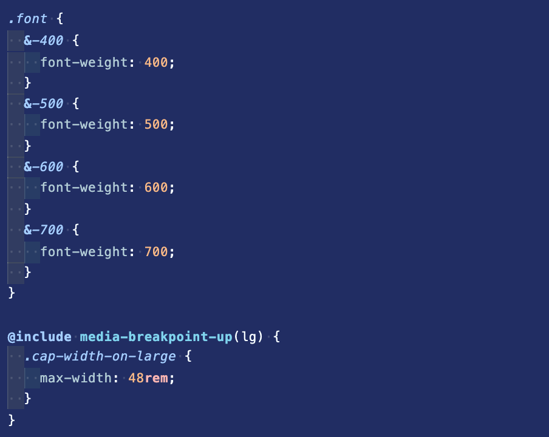
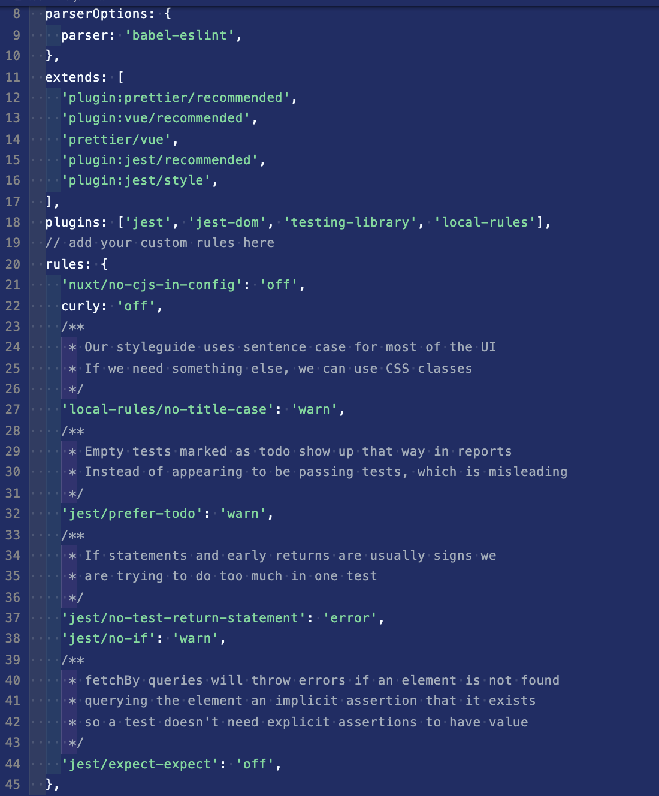
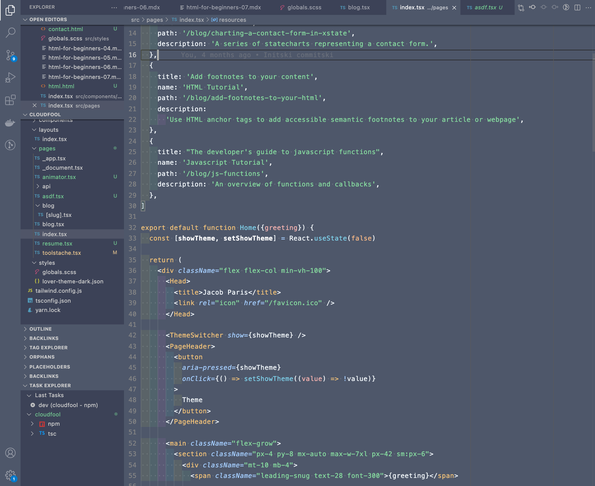
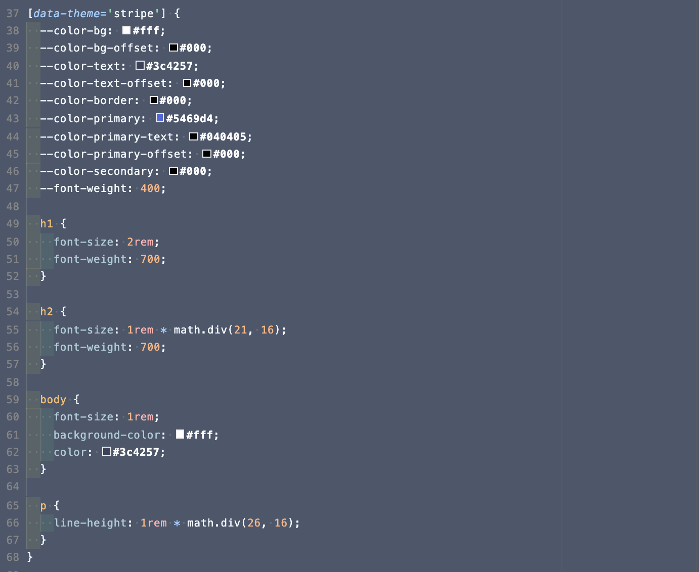
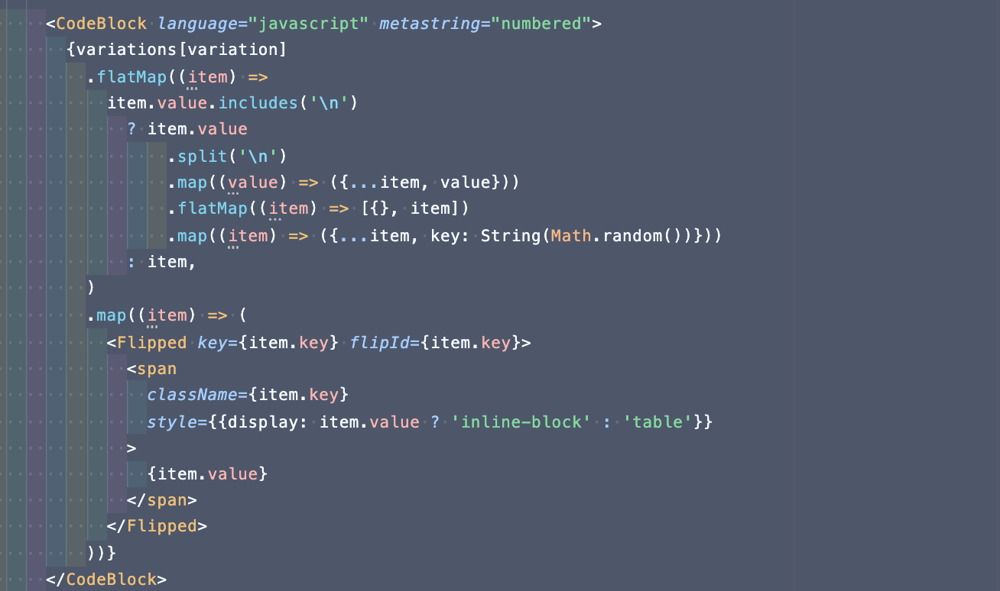

# Stripe Docs Theme

A collection of VS Code themes based on the Stripe docs

Contributions are encouraged! For styling updates, make a PR and include a screenshot of what changed for reference

Right now publishing is manual but when I figure out how to auto-publish on merge to main, it should work that way.

## Blue

Based on [Stripe Docs](https://stripe.com/docs/stripe-js)

## Gray

Based on [Stripe Elements](https://stripe.com/docs/js/element)

